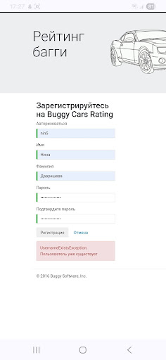

# 🐞 BUG-002

## Summary

**A technical error message is displayed when registering with an existing username.**

---

## Environment

| Parameter | Value |
|-----------|-------|
| Device | Samsung Galaxy A24 |
| OS | Android 16 |
| Browser | Google Chrome Mobile 149.0.7827.59 |
| Website | https://buggy.justtestit.org |

---

## Preconditions

1. Open the website: https://buggy.justtestit.org
2. A user with the username **"nin5"** is already registered.

---

## Steps to Reproduce

1. Open the registration page.
2. Enter the existing username **"nin5"**.
3. Fill in all other required fields.
4. Click **Register**.

---

## Actual Result

The system displays the technical error message:

**"UsernameExistsException: Пользователь уже существует".**

---

## Expected Result

The system should display a clear, user-friendly message without technical details, for example:

**"A user with this username already exists."**

---

## Severity

🟢 Minor

---

## Priority

🟡 Medium

---

## Screenshot

