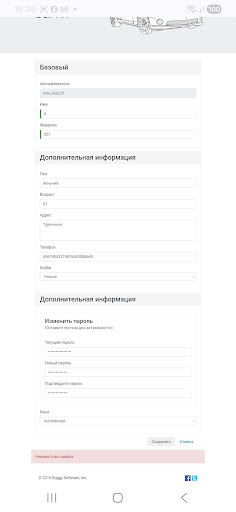

# 🐞 BUG-003

## Summary

**The "First Name" and "Last Name" fields accept numeric values.**

---

## Environment

| Parameter | Value |
|-----------|-------|
| Device | Samsung Galaxy A24 |
| OS | Android 16 |
| Browser | Google Chrome Mobile 149.0.7827.59 |
| Website | https://buggy.justtestit.org |

---

## Preconditions

1. Open the website: https://buggy.justtestit.org
2. The user is logged in.
3. Open the Profile page.

---

## Steps to Reproduce

1. Enter **"6"** in the **First Name** field.
2. Enter **"007"** in the **Last Name** field.
3. Click **Save**.

---

## Actual Result

The **First Name** and **Last Name** fields accept numeric values and the data is saved successfully.

---

## Expected Result

The **First Name** and **Last Name** fields should accept only alphabetic characters.  
When numeric values are entered, the system should display a validation error message and prevent saving the data.

---

## Severity

🟡 Medium

---

## Priority

🟡 Medium

---

## Screenshot

