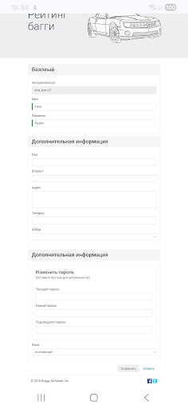
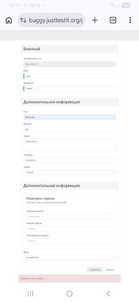

# 🐞 BUG-004

## Summary

Entered profile data is cleared after a validation error occurs during saving.

---

## Environment

| Parameter | Value |
|-----------|-------|
| Device | Samsung Galaxy A24 |
| OS | Android 16 |
| Browser | Google Chrome Mobile 149.0.7827.59 |
| Website | https://buggy.justtestit.org |

---

## Preconditions

1. Open the website: https://buggy.justtestit.org
2. User is logged into the system.

---

## Steps to Reproduce

1. Enter **"abc"** into the **Age** field.
2. Enter **"12345678"** into the **Phone** field.
3. Click **Save**.
4. Refresh the profile page.

---

## Actual Result

After the validation error occurs, all entered profile data (Age, Gender, Address, Phone, Hobby) is cleared.

---

## Expected Result

The entered data should remain in the form so the user can correct the invalid field without entering all information again.

---

## Severity

🟡 Medium

---

## Priority

🟡 Medium

---

## Attachment
### Screenshot 1

### Screenshot 2

